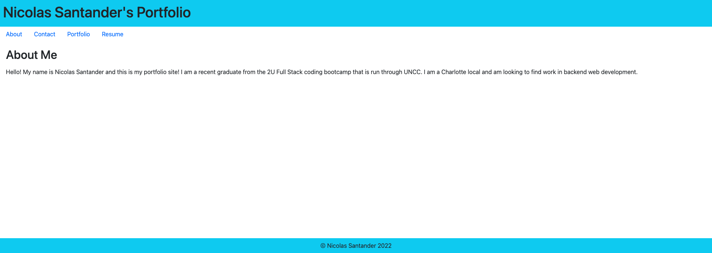

# Nicolas Santander React Portfolio

## Table of Contents
* [Description](#description)
* [Visuals](#visuals)

## Description

[Link to live site](https://nsantander1095.github.io/react-portfolio-project/)

My portfolio website is a rudimentary application that is created using React and Bootstrap. The styling on the site is rough, but the main functionality of conditionally rendering components and pages using the ReactDOM package was the main focus of the project. 

## Visuals

