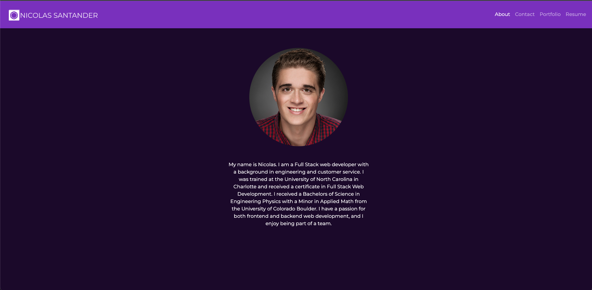

# Nicolas Santander React Portfolio

## Table of Contents
* [Description](#description)
* [Technologies](#technologies)
* [Visuals](#visuals)

## Description

[Link to live site](https://nsantander1095.github.io/nsantander-portfolio/)

My portfolio is a front end application using React and Bootstrap to handle the layout of the app. The app provides necessary information about myself, my contanct info, and the work that I have done in the past to demonstrate my experience. It also repsresents my ability to put together a working front end to showcase those skills. 

## Technologies

- React
- Bootstrap

## Visuals

